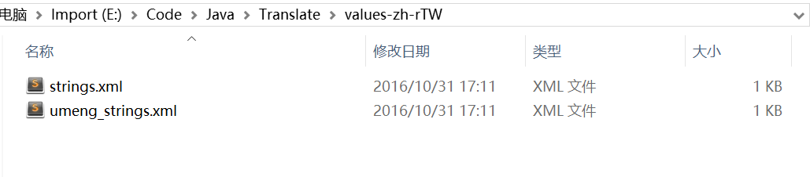
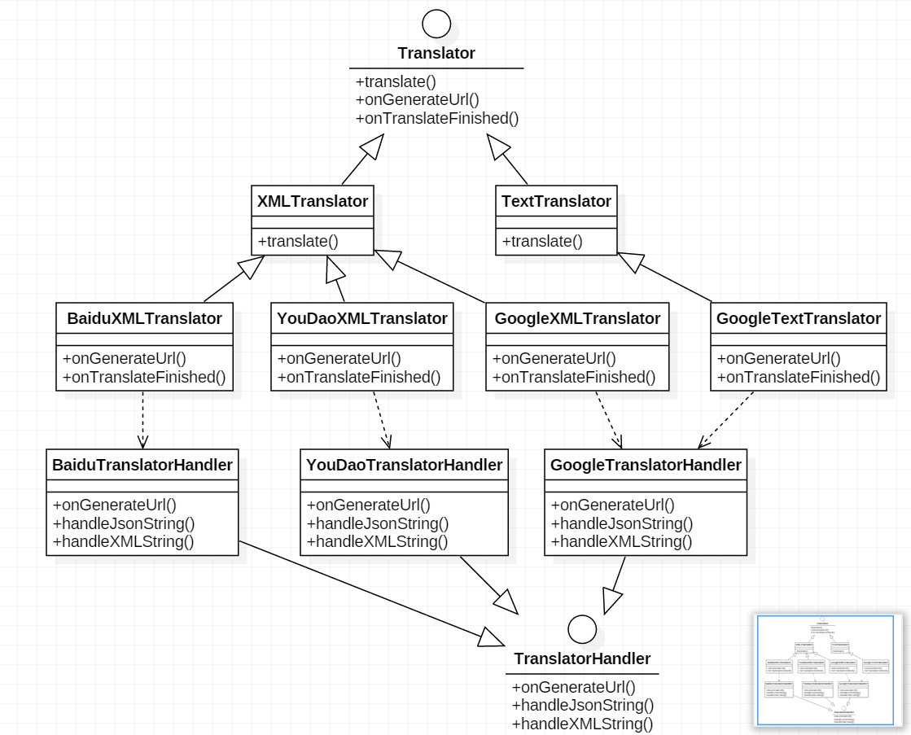

Android string.xml 翻译工具
===========================

源码你可以在Github上看到：https://github.com/onlynight/Translator

# 概述
最近要把公司的app往国外推广，无奈只做了中文版，好在所有的字符串都是写在string.xml文件中的，为了快速推出海外版本，决定有机器翻译先做一个简单的版本。说到这里问题就来啦，这么多文本难道一句一句的复制粘贴呀，当然写个小工具翻译既省时又省力。想法有了找一下翻译平台，首先想到google但是google要翻墙对网络环境不太好的小伙伴要求太高，所以想到了国内的百度翻译和有道翻译。

当你需要快速翻译string.xml资源字符串中的文本时你就可以使用这个工具啦，这个工具还支持拓展，只需简单几部就能完成拓展，下面我们就来详细介绍下这个工具的实现以及拓展方法。

# 使用

使用前你需要配置各个平台的key，在{@link com.github.onlynight.android.string_xml.translate.utils.Constants}类中对平台的key进行配置，平台文档地址：

- google https://cloud.google.com/translate/v2/quickstart
- 百度 http://api.fanyi.baidu.com/api/trans/product/apidoc
- 有道 http://fanyi.youdao.com/openapi

在```Main.java```中有使用的demo，你可以参考demo中的代码，如果你需要自定义翻译文件你需要做做如下操作：

### 1.初始化```TranslateManager```
使用前需要先初始化翻译管理器，需要注意的是，如果你要切换其他平台翻译的话你需要重新初始化。

```java
TranslateManager.getInstance().
	init(currentPath.getAbsolutePath(),
	translateAllXml, TranslatePlatform.GOOGLE);
```

- 第一个参数是要翻译的路径，demo中传入的是项目的根目录
- 第二个参数标识是否要翻译该目录下的所有xml文件
- 最后一个参数标识翻译平台

### 2.调用翻译函数
初始化完成后就可以开始翻译了：

```java
TranslateManager.getInstance().translate(Language.CN, Language.EN);
```

- 第一个参数是源语言
- 第二个参数是要翻译的目标语言

### 3.查看翻译结果
调用翻译函数后查看日志直到翻译完成为止，目标文件生成在指定的翻译目录下```values-xxx```文件夹中。




**注意：**
目前只支持在Intellij Idea中运行，打包成jar文件执行时文件乱码问题暂未解决，所以你需要安装Intellij Idea运行工程。

# 实现以及结构分析
首先我们先来看下类图：



很明显实现Translator的类和间接实现的类是一个标准的适配器模式，适配器模式可以将多种实现协调在一起工作，这样就可以实现不止XML解析并翻译，还可以实现其文件类型的翻译，比如```TextTranslator```。下面这一层```TranslatorHandler```将每个翻译平台的公共操作抽象出来，然后每个平台的具体实现都有一个实现类。之所以没有把这些具体的操作放在具体的Translator类中，是因为这些操作和具体的```Translator```的实现无关，这样分离以后代码复用效率高。

这张类图清晰的展示了整个项目的类结构：

1. 首先，先声明一个接口```Translator```这个类中定义了抽象操作以及一些公共方法。```translate```方法就是公共翻译入口，调用这个方法就是翻译；```onGenerateUrl```方法中需要返回平台REST_API所需的完整请求url，其调用时机应该在translate方法中（或者在其过程的方法中）；```onTranslateFinished```调用REST_API返回String时对这个String进行json或者xml化处理，视实际情况而定。
2. ```TypedTranslator```这一层类是每一种翻译器的抽象实现类，这一层中实现了具体的平台的功能，但是每个```Translator```又会去调用平台特定的```TranslatorHandler```，```TranslatorHandler```中将平台的公共操作抽象出来提高复用。
3. ```TranslatorHandler```中实现各个平台自己的实现，```onGenerateUrl```需要返回平台REST_API所需的完整请求url，```handleJsonString```中返回处理json string的结果，```handleXMLString```返回处理xml string的结果，这两个函数视情况而定，根据平台的返回值看需要哪个函数，或者两个都实现。

上面分析了该工具的主要结构，下面来说一下其他的辅助类：

- ```TranslatorManager```
翻译管理器，同一管理平台初始化以及调用翻译平台翻译。
- ```TranslatorPlatform```
定义翻译平台
- ```Language```
定义翻译语言
- ```Constants```
定义常用全局变量，比如平台key等其他静态配置。

# 拓展
简要说明在```Main.java```文件中已说明，下面视详细说明：

## 1.定义平台
如果你要拓展新的翻译平台，你需要在{@link com.github.onlynight.android.string_xml.translate.translator.TranslatePlatform}中添加新的平台，这是定义平台的第一步，后续还要做一些和平台相关的配置。

## 2.拓展```XMLTranslator```
继承自```XMLTranslator```类并实现它的所有抽象方法，我们暂时命名为```PlatformXMLTranslator```。```PlatformXMLTranslator```实际上只是一个代理类，但是为了方便拓展其他的功能并没有实现```Translator```接口，而是重新定义接口尽量使函数名称相似。

## 3.实现```TranslatorHandler```
新添加的平台需要实现一个```TranslatorHandler```，这个类中定义了每个平台具体的操作。```onGenerateUrl```返回最终的请求平台的url，根据平台不同的规范拼接生成REST_API的url。```handleJsonString```和```handleXMLString```两个方法，这里暂时定义两种不同的返回结果处理函数，你也可以根据你的需求拓展这些接口。在```PlatformXMLTranslator```中实例化这个```TranslatorHandler```并在对应的方法中调用handler中对应的方法。

## 4.注意
目前只添加了简体中文，繁体中文，英文，日文集中语言，如果你需要添加其他语言你需要做以下几件事：

1. 在{@link com.github.onlynight.android.string_xml.translate.translator.TranslatePlatform}中新建一个平台，并且将新添加的平台配置到{@link com.github.onlynight.android.string_xml.translate.utils.Constants}类中的platformConfig中去，具体方法参考其他平台配置。
2. {@link com.github.onlynight.android.string_xml.translate.translator.Language}中添加新的语言这里使用的是google翻译平台标准简称，如果你使用其他平台需要将简称转换以下，参考{@link com.github.onlynight.android.string_xml.translate.translator.xmlImpl.BaiduXMLTranslator}中的转换方法。
3. 你需要在{@link com.github.onlynight.android.string_xml.translate.utils.Constants}中配置valuesFolders，添加不同语言对应的文件夹。


[Github_Source]: https://github.com/onlynight/Translator
